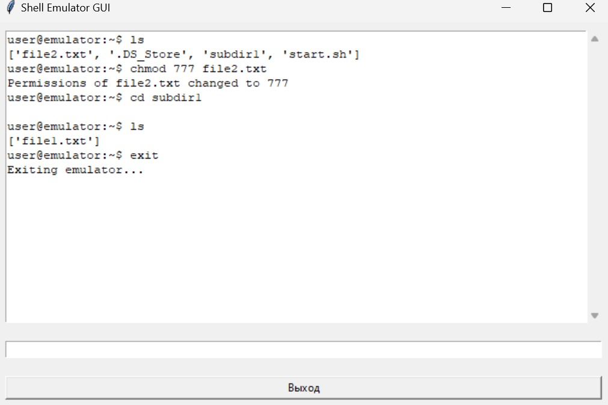
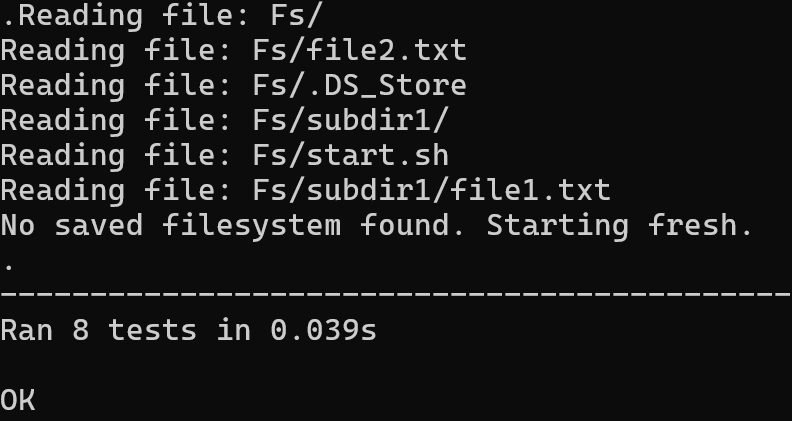

Задание №1
- Разработать эмулятор для языка оболочки ОС.
- Необходимо сделать работу эмулятора как можно более похожей на сеанс shell в UNIX-подобной ОС.
- Эмулятор должен запускаться из реальной командной строки, а файл с виртуальной файловой системой не нужно распаковывать у пользователя.
- Эмулятор принимает образ виртуальной файловой системы в виде файла формата zip.
- Эмулятор должен работать в режиме GUI.
- Ключами командной строки задаются:
  - Путь к архиву виртуальной файловой системы.
  - Путь к лог-файлу.
- Лог-файл имеет формат xml и содержит все действия во время последнего сеанса работы с эмулятором.
- Для каждого действия указаны дата и время.
- Необходимо поддержать в эмуляторе команды ls, cd и exit, а также следующие команды:
  - mv.
  - chmod.
- Все функции эмулятора должны быть покрыты тестами, а для каждой из поддерживаемых команд необходимо написать 3 теста.

Shell Emulator — это программное приложение, эмулирующее работу файловой системы. Оно предоставляет интерфейс для взаимодействия с файлами и каталогами через текстовые команды или графический интерфейс. Проект разработан для изучения работы с файловыми системами, тестирования Python-кода и логирования пользовательских операций.

Основная цель — создание учебного инструмента для понимания принципов работы с файловой системой, включая управление файлами, навигацию по каталогам и обработку команд.

Основные возможности
Навигация по файловой системе: просмотр содержимого каталогов, переход между директориями, отображение структуры дерева.
Работа с файлами: просмотр содержимого файлов, подсчет строк, слов и символов, изменение прав доступа.
Графический интерфейс: интуитивно понятное окно для ввода команд и просмотра результатов.
Логирование: автоматическая запись всех выполненных операций для анализа и отладки.
Тестирование: встроенные тесты для проверки функциональности всех команд.

Логи в Shell Emulator выполняют важную роль:

Анализ пользовательских действий: Все выполненные команды записываются в лог-файл. Это помогает восстановить цепочку действий пользователя и понять, как выполнялись команды.
Отладка: Логи позволяют разработчикам находить ошибки в работе программы, анализируя последовательность выполненных операций.
Сохранение истории: Они служат архивом всех операций, что может быть полезно для учебных целей или анализа активности.
Расширение функционала: На основе логов можно добавить функции аудита или автоматического анализа действий.
Компоненты проекта
1. Эмулятор файловой системы
Shell Emulator работает с виртуальной файловой системой, загружаемой из ZIP-архива. Пользователь может выполнять команды для работы с файлами и каталогами, такие как:
- ls — просмотр содержимого текущего каталога.
- cd — переход в другой каталог.
- mv — перемещает файлы.
- chmod — изменение прав доступа к файлу.
- exit — прекращение работы.
Эмулятор ведет себя как упрощенная версия командной строки, предоставляя базовые возможности для работы с файлами.

2. Графический интерфейс
Графический интерфейс (GUI), созданный с использованием tkinter, позволяет:
- Вводить команды через текстовое поле.
- Видеть результаты выполнения команд в прокручиваемом окне.
- Удобно управлять эмулятором через кнопки.

Ниже приведен пример работы эмулятора:

3. Согласно заданию, было осуществлено тестирование, оказавшееся успешным:

4. Файловая система
Файловая система загружается из ZIP-архива (Fs.zip). Архив должен содержать файлы и каталоги, с которыми пользователь будет работать.
